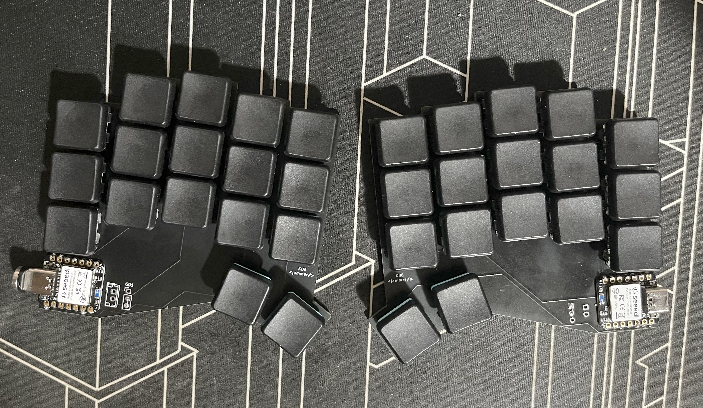
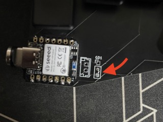
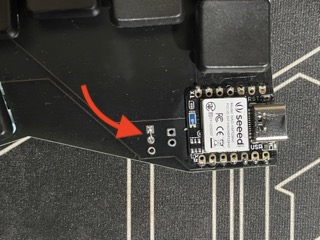

# Kiai Wireless Split Keyboard


## Features
- Seeed Studio XIAO nRF52840 
- ZMK
- 34-keys 
- low profile Choc v1

## Requirements
- Seeed Studio XIAO nRF52840 (2)
- Choc v1 switche (34)
- 1N4148 SOD-123  (34)
- 2 pcbs (gerbers and kicad files shared in this repo)
- 3.7v lipo batteries (2)


## Build Notes
Because I wanted to have the xiao modules both facing up so the built-in reset button on the xiao is readily accessible, there are a couple of things that may be different from how other boards are normally set up.

For the left hand side, need to jumper the bottom two holes as shown below:



The right side will also need the jumper but on the upper two holes instead:



The diodes should mirror the orientation on the opposite board.


## Flashing the Firmware
For convenience, the compiled uf2 files are in the bin folder. 
`left.uf2` -> for the left side
`right.uf2` -> for the right side
`reset.uf2` -> can be flashed to both boards to reset. I found this useful when the slave side is not pairing with the master side.

### How to upload the firmware to your board:
- Connect one keyboard to your computer via USB 
- Double-click the reset button on the xiao module on the left board. When the XIAO-SENSE folder appears, copy over `left.uf2` onto that folder. It will automatically eject after.
- Do the same to the right keyboard, this time flashing the `right.uf2` file.
- TIP: immediately after flashing try to put the keyboard into bootloader mode. This prevents it from trying to pair before you are ready. Re-activate the two sides at the same time; this usually helps when you find the slave side does not register keystrokes. 

## Building/Compiling your own firmware

- install ZMK following this guide: [ZMK Basic Setup](https://zmk.dev/docs/development/setup) 
- in your `{zmk-dir}/app/board/shields` directory, create a folder named `kiai`
- copy the files in the `zmk` folder in this repo into your new `kiai` directory
- compile the hex file for your left board using 
  
  ```west build -p -b seeeduino_xiai_ble -d build/kiai/left -- -DSHIELD=kiai_left```
- this will create a `zmk.uf2` file in `{zmk-dir}/app/build/kiai/left/zephyr`
- use this file to flash the left-side board
- compile the hex file for your right-side board using
  
  ```west build -p -b seeeduino_xiai_ble -d build/kiai/right -- -DSHIELD=kiai_right```

- this will create a `zmk.uf2` file in `{zmk-dir}/app/build/kiai/right/zephyr`
- use this file to flash the right-side board


